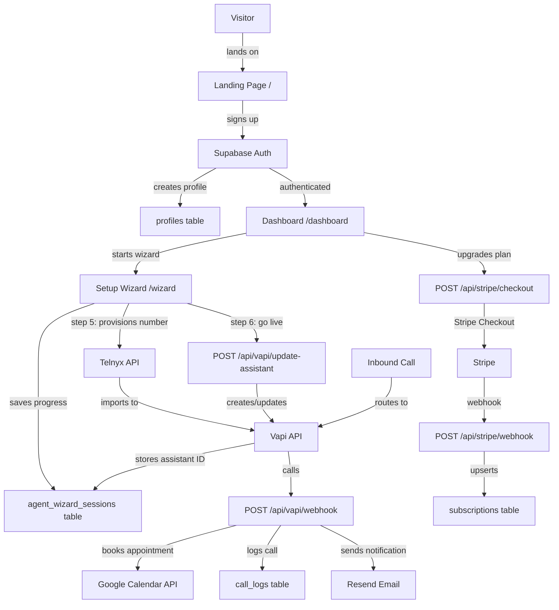
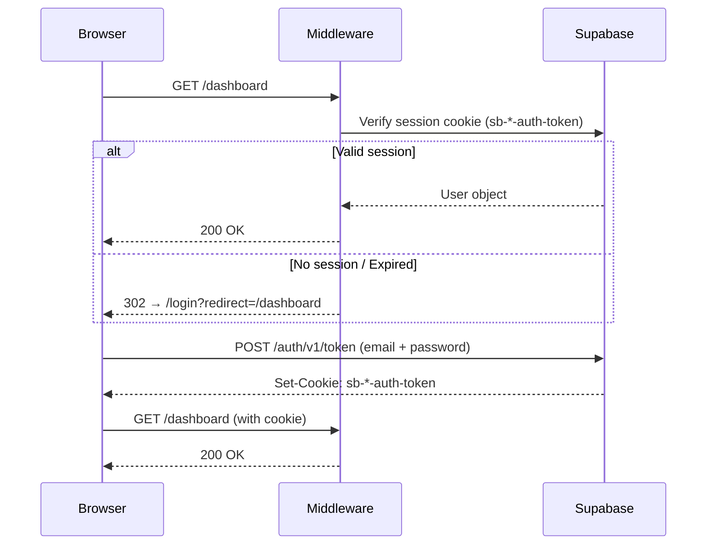
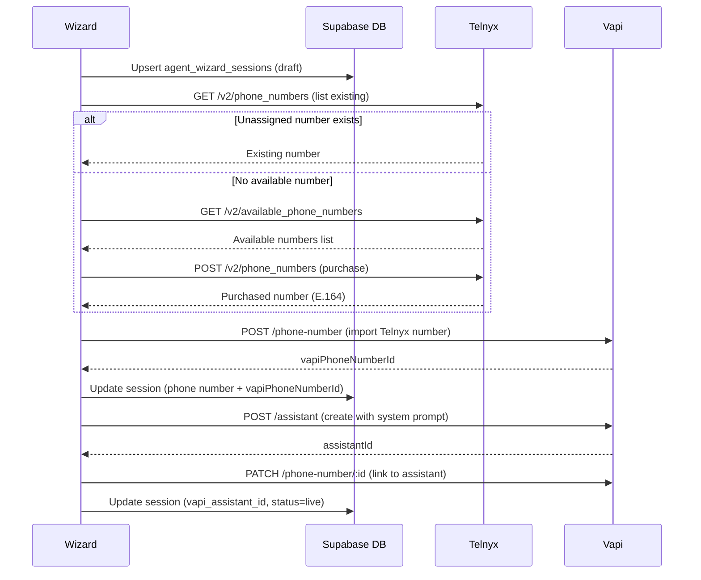
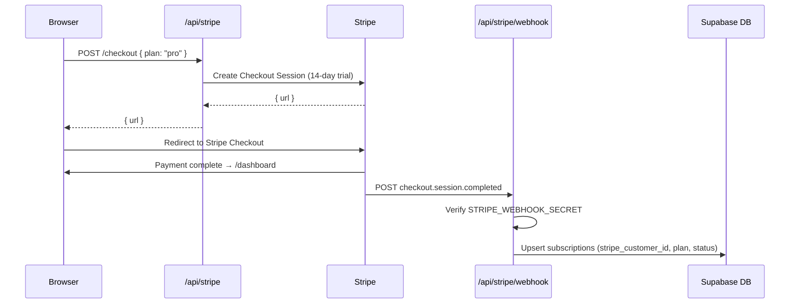
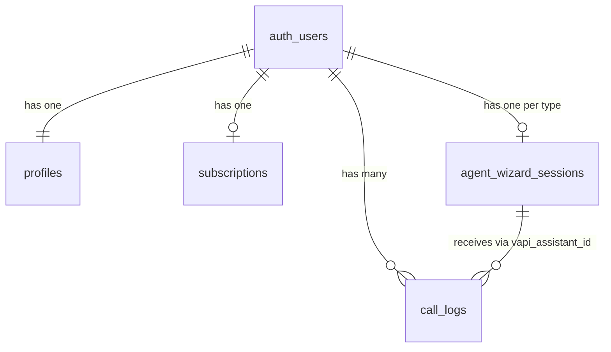

# CodeFounder

**AI voice agents for small and medium businesses — live in minutes, not months.**

CodeFounder is a full-stack SaaS platform that lets business owners build, configure, and deploy AI receptionists that answer inbound phone calls, book appointments into Google Calendar, and handle customer FAQs — 24/7, with no code required. Businesses complete a six-step wizard, provision a real phone number, and launch a live AI agent backed by Vapi, Telnyx, and GPT-4o.

---

## Table of Contents

- [Features](#features)
- [Screenshots](#screenshots)
- [Tech Stack](#tech-stack)
- [Architecture](#architecture)
- [Project Structure](#project-structure)
- [Environment Variables](#environment-variables)
- [Local Development](#local-development)
- [Stripe Integration](#stripe-integration)
- [Database Schema](#database-schema)
- [API Reference](#api-reference)
- [Security](#security)
- [Deployment](#deployment)
- [Development Workflow](#development-workflow)
- [Contributing](#contributing)
- [License](#license)
- [Contact](#contact)

---

## Features

### AI Voice Agents
- Deploys an AI receptionist powered by **Vapi** + **GPT-4o** to a real US phone number
- Handles inbound calls, answers FAQs, collects caller name and intent, transfers to a human on request
- Mandatory AI transparency disclosure at call start: *"You are speaking with an AI assistant. This call may be recorded."*
- Dynamic system prompt generated from wizard configuration (business name, category, timezone, hours, services, tone)
- Live test call in-browser before going live via Vapi Web SDK

### Agent Builder (Setup Wizard)
- **6-step guided wizard** that takes any business from zero to live agent in under 10 minutes
  1. **Agent Type** — Select agent type (Voice Agent available; HR, Marketing, and CRM agents on roadmap)
  2. **Business Profile** — Name, category (46 options), timezone (22 options), location, hours per day-of-week, services description
  3. **Configure Agent** — Agent name, greeting script, FAQ bank, tone (Friendly / Professional / Upbeat), optional human call-forwarding number
  4. **Connect Calendar** — Optional Google Calendar OAuth for live appointment booking
  5. **Phone Number** — Provision a new US number via Telnyx, or use an existing forwarding number
  6. **Test & Launch** — Live browser test call, then one-click Go Live
- Progress auto-saved to database at every step (session resumable)

### Dashboard
- At-a-glance stats: total calls, minutes used, active agents, trial/plan status
- Recent call activity feed with transcript previews
- Welcome banner with first-name personalisation
- Live usage bar against plan limits
- Dark/light theme toggle persisted to `localStorage`

### Call Management
- Full call log with search by caller and date range filtering
- Per-call detail panel: transcript viewer, recording playback URL, duration, timestamp, caller number
- Status badges (ended, missed, transferred)
- Relative timestamps ("2h ago")

### Billing & Subscriptions
- Three plans: **Starter** ($149/mo), **Pro** ($299/mo), **Elite** ($599/mo)
- 14-day free trial on all plans with no credit card required at signup
- Stripe Checkout for plan upgrades
- Stripe Customer Portal for self-serve plan changes and cancellation
- Upcoming invoice preview
- Per-plan usage limits (calls/month, AI minutes/month)

### Authentication & User Management
- Email/password signup and login via Supabase Auth
- Google OAuth sign-in
- Password reset via email
- Profile management (full name, username, email, password change)
- Session refresh via server-side SSR middleware

### Admin Panel
- Role-based access (database `role` column or `ADMIN_EMAIL` env fallback)
- User list with account status, plan, and creation date
- Admin-only sidebar navigation

### Integrations
- **Vapi** — Voice AI infrastructure, assistant CRUD, call webhooks
- **Telnyx** — Phone number provisioning and management
- **Google Calendar** — Real-time appointment booking via API
- **Stripe** — Subscription billing and customer portal
- **Resend** — Transactional emails (welcome, new call, appointment booked)
- **Supabase** — Auth, database, Row Level Security

### Legal & Compliance Pages
- Privacy Policy, Terms of Service, Refund & Cancellation Policy, Acceptable Use Policy, Contact page with functional email form

---

## Screenshots

| Page | Description |
|------|-------------|
|  | **Landing Page** — Hero, services, process, case studies, pricing, FAQ, contact |
|  | **Dashboard** — Stats overview, recent calls, agent status, plan usage |
|  | **Setup Wizard** — Step-by-step agent configuration |
|  | **Call Logs** — Full call history with transcript viewer |
|  | **Billing** — Subscription management, usage bars, Stripe portal |
|  | **Settings** — Profile, security, business info |

> Drop PNG files into `.github/screenshots/` to render the screenshots above.

---

## Tech Stack

| Layer | Technology |
|-------|-----------|
| **Framework** | [Next.js 16](https://nextjs.org/) (App Router, Server Components, API Routes) |
| **Language** | TypeScript 5 (strict mode) |
| **UI Library** | React 19 |
| **Styling** | Tailwind CSS v4 + CSS custom properties (design tokens) |
| **Icons** | Lucide React |
| **Database** | [Supabase](https://supabase.com/) (PostgreSQL) |
| **Authentication** | Supabase Auth (email/password + Google OAuth) |
| **Payments** | [Stripe](https://stripe.com/) v22 (Checkout, Billing Portal, Webhooks) |
| **Voice AI** | [Vapi](https://vapi.ai/) (LLM orchestration, call handling, webhooks) |
| **LLM** | GPT-4o via Vapi |
| **Telephony** | [Telnyx](https://telnyx.com/) (phone number provisioning, E.164) |
| **Speech** | Deepgram (transcription via Vapi), OpenAI alloy (TTS via Vapi) |
| **Calendar** | Google Calendar API v3 (OAuth2, appointment booking) |
| **Email** | [Resend](https://resend.com/) v6 |
| **Hosting** | [Vercel](https://vercel.com/) |
| **State** | React `useState` / `useContext` (no external state library) |

---

## Architecture

### Application Flow



### Authentication Flow



### Agent Creation Flow



### Billing Flow



---

## Project Structure

```
codefounder/
├── src/
│   ├── app/
│   │   ├── (auth)/                     # Unauthenticated pages
│   │   │   ├── login/page.tsx
│   │   │   ├── signup/page.tsx
│   │   │   ├── forgot-password/page.tsx
│   │   │   └── reset-password/page.tsx
│   │   ├── (dashboard)/                # Protected — requires auth
│   │   │   ├── layout.tsx              # Sidebar + Navbar shell
│   │   │   ├── dashboard/page.tsx      # Overview stats
│   │   │   ├── wizard/page.tsx         # 6-step agent builder
│   │   │   ├── agents/page.tsx         # Agent list + status
│   │   │   ├── calls/page.tsx          # Call history + transcripts
│   │   │   ├── billing/page.tsx        # Stripe subscription view
│   │   │   └── settings/page.tsx       # Profile + security
│   │   ├── admin/                      # Protected — requires admin role
│   │   │   ├── layout.tsx
│   │   │   ├── page.tsx
│   │   │   └── users/page.tsx
│   │   ├── api/
│   │   │   ├── stripe/
│   │   │   │   ├── checkout/route.ts   # Create Checkout Session
│   │   │   │   ├── portal/route.ts     # Customer Portal redirect
│   │   │   │   └── webhook/route.ts    # Process Stripe events
│   │   │   ├── vapi/
│   │   │   │   ├── webhook/route.ts    # Process call events
│   │   │   │   └── update-assistant/route.ts
│   │   │   ├── phone/
│   │   │   │   └── provision-number/route.ts
│   │   │   ├── calendar/
│   │   │   │   └── book/route.ts
│   │   │   └── contact/route.ts
│   │   ├── auth/callback/route.ts      # OAuth code exchange
│   │   ├── pricing/page.tsx
│   │   ├── contact/page.tsx
│   │   ├── privacy/page.tsx
│   │   ├── terms/page.tsx
│   │   ├── refund/page.tsx
│   │   ├── acceptable-use/page.tsx
│   │   ├── globals.css                 # Design tokens + Tailwind
│   │   ├── layout.tsx                  # Root layout
│   │   └── page.tsx                    # Landing page
│   ├── components/
│   │   ├── auth/                       # Auth form, field, validation
│   │   ├── dashboard/                  # Navbar, Sidebar, WelcomeBanner
│   │   ├── landing/                    # Landing page sections
│   │   ├── ui/                         # Button, Input, Card primitives
│   │   ├── Logo.tsx
│   │   └── ThemeProvider.tsx
│   ├── hooks/
│   │   ├── useProfile.ts
│   │   └── useTheme.ts
│   ├── lib/
│   │   ├── supabase/server.ts          # SSR Supabase client
│   │   ├── supabase.ts                 # Browser Supabase client
│   │   ├── vapi/prompt.ts              # System prompt builder
│   │   ├── wizard/storage.ts           # Wizard DB persistence
│   │   ├── email/                      # Resend client + templates
│   │   ├── types/                      # TypeScript types
│   │   ├── agents.ts                   # Agent type registry
│   │   ├── plans.ts                    # Pricing config
│   │   └── format.ts                   # Date/duration helpers
│   └── middleware.ts                   # Auth routing + session refresh
├── supabase/
│   └── migrations/                     # Sequential SQL migrations (001–008)
├── public/                             # Static assets (logo, brandmark)
├── next.config.ts
├── tsconfig.json
├── postcss.config.mjs
├── package.json
└── .env.example
```

---

## Environment Variables

Copy `.env.example` to `.env.local` and fill in every value before running the app.

### Required

| Variable | Description |
|----------|-------------|
| `NEXT_PUBLIC_SUPABASE_URL` | Supabase project URL (`https://<ref>.supabase.co`) |
| `NEXT_PUBLIC_SUPABASE_ANON_KEY` | Supabase anon (public) key |
| `SUPABASE_SERVICE_ROLE_KEY` | Supabase service role key — bypasses RLS; **never expose client-side** |
| `NEXT_PUBLIC_VAPI_PUBLIC_KEY` | Vapi public key for browser SDK (test calls in wizard) |
| `VAPI_API_KEY` | Vapi secret API key for server-side assistant CRUD |
| `VAPI_ASSISTANT_ID` | Default Vapi assistant ID |
| `TELNYX_API_KEY` | Telnyx API key for phone number provisioning |
| `NEXT_PUBLIC_STRIPE_PUBLISHABLE_KEY` | Stripe publishable key |
| `STRIPE_SECRET_KEY` | Stripe secret key |
| `STRIPE_WEBHOOK_SECRET` | Stripe webhook signing secret (`whsec_…`) |
| `RESEND_API_KEY` | Resend API key for transactional email |
| `RESEND_FROM_EMAIL` | Sender email address (must be verified in Resend) |
| `NEXT_PUBLIC_SITE_URL` | Full app URL — used in email links and OAuth redirects |
| `ADMIN_EMAIL` | Bootstrap admin user email (grants admin access without DB role) |

### Optional

| Variable | Description |
|----------|-------------|
| `VAPI_WEBHOOK_SECRET` | If set, validates `x-vapi-secret` header on call webhooks |
| `GOOGLE_CLIENT_ID` | Google OAuth client ID for Calendar integration |
| `GOOGLE_CLIENT_SECRET` | Google OAuth client secret |
| `GOOGLE_REFRESH_TOKEN` | Long-lived refresh token for Google Calendar API |
| `GOOGLE_CALENDAR_ID` | Target calendar (default: `primary`) |
| `CALENDAR_WEBHOOK_SECRET` | If set, validates `x-webhook-secret` on `/api/calendar/book` |
| `NEXT_PUBLIC_ADMIN_EMAIL` | Client-side admin email for UI permission checks |

---

## Local Development

### Prerequisites

- Node.js ≥ 20
- A [Supabase](https://supabase.com) project
- A [Vapi](https://vapi.ai) account with an assistant
- A [Telnyx](https://telnyx.com) account with API key
- A [Stripe](https://stripe.com) account (test mode)
- A [Resend](https://resend.com) account

### 1. Clone and Install

```bash
git clone https://github.com/abhishekverma0700/codefounder.git
cd codefounder
npm install
```

### 2. Configure Environment

```bash
cp .env.example .env.local
```

Edit `.env.local` with your credentials. See the [Environment Variables](#environment-variables) table above.

### 3. Set Up the Database

Run the migrations in order against your Supabase project. Using the Supabase CLI:

```bash
supabase link --project-ref <your-project-ref>
supabase db push
```

Or run each file in `supabase/migrations/` sequentially via the Supabase SQL editor (001 → 008).

### 4. Configure Stripe Products

Create three products in your Stripe dashboard:

| Product | Price | Metadata key |
|---------|-------|--------------|
| Starter | $149/month | `plan=starter` |
| Pro | $299/month | `plan=pro` |
| Elite | $599/month | `plan=elite` |

Update the price IDs in `src/lib/plans.ts` to match your Stripe price IDs.

### 5. Forward Stripe Webhooks Locally

```bash
stripe listen --forward-to localhost:3000/api/stripe/webhook
```

Copy the printed signing secret into `STRIPE_WEBHOOK_SECRET` in `.env.local`.

### 6. Configure Vapi Webhook

In the Vapi dashboard, set your server URL to your local tunnel URL:

```
https://<your-ngrok>.ngrok.io/api/vapi/webhook
```

### 7. Start the Dev Server

```bash
npm run dev
```

App runs at [http://localhost:3000](http://localhost:3000).

### 8. Build for Production

```bash
npm run build
npm start
```

---

## Stripe Integration

### Checkout Flow

1. User selects a plan at `/pricing` or `/billing`
2. Browser calls `POST /api/stripe/checkout` with `{ plan: "pro" }`
3. Server creates a Stripe Checkout Session with a 14-day free trial
4. User is redirected to Stripe-hosted checkout
5. On success, Stripe redirects back to `/dashboard`
6. Stripe delivers a `checkout.session.completed` webhook

### Webhook Handler

`POST /api/stripe/webhook` verifies the request signature using `STRIPE_WEBHOOK_SECRET`, then on `checkout.session.completed`:
- Extracts `stripe_customer_id`, `stripe_subscription_id`, and `plan` from session metadata
- Upserts the `subscriptions` table row using the Supabase service role key (bypasses RLS)
- Sets `status` to `trialing` (when `payment_status === "no_payment_required"`) or `active`

### Customer Portal

`POST /api/stripe/portal` (authenticated) looks up the user's `stripe_customer_id` from the `subscriptions` table, creates a Stripe billing portal session, and redirects the user. From the portal, users can change plans, update payment methods, and cancel.

### Subscription Display

The `/billing` page fetches the subscription record from Supabase, retrieves the upcoming invoice from the Stripe API, and renders current plan, trial end date, next billing amount, and usage bars.

---

## Database Schema

### `profiles`

Stores extended user data. Automatically created by a trigger when a new `auth.users` row is inserted.

| Column | Type | Notes |
|--------|------|-------|
| `id` | UUID (PK) | FK → `auth.users(id)` ON DELETE CASCADE |
| `username` | text (UNIQUE) | Derived from email on signup |
| `full_name` | text | |
| `email` | text | |
| `role` | text | `user` \| `admin` (default: `user`) |
| `created_at` | timestamptz | |

### `agent_wizard_sessions`

Stores the full configuration state for each user's voice agent.

| Column | Type | Notes |
|--------|------|-------|
| `id` | UUID (PK) | |
| `user_id` | UUID (FK) | → `auth.users(id)` ON DELETE CASCADE |
| `agent_type` | text | `voice` (default) |
| `current_step` | integer | 0–5 |
| `status` | text | `draft` \| `live` |
| `business_details` | JSONB | Name, category, hours, services, timezone |
| `voice_settings` | JSONB | Agent name, greeting, FAQs, tone, phone details |
| `vapi_assistant_id` | text | Set on Go Live |
| `twilio_phone_number` | text | E.164 US number provisioned via Telnyx |
| `updated_at` | timestamptz | |

Unique constraint: `(user_id, agent_type)` — one agent per type per user.

### `subscriptions`

One row per user, created/updated by the Stripe webhook.

| Column | Type | Notes |
|--------|------|-------|
| `id` | UUID (PK) | |
| `user_id` | UUID (FK, UNIQUE) | → `auth.users(id)` ON DELETE CASCADE |
| `stripe_customer_id` | text (UNIQUE) | |
| `stripe_subscription_id` | text (UNIQUE) | |
| `plan` | text | `starter` \| `pro` \| `elite` |
| `status` | text | `trialing` \| `active` \| `canceled` |
| `created_at` | timestamptz | |

### `call_logs`

One row per inbound call, inserted by the Vapi webhook.

| Column | Type | Notes |
|--------|------|-------|
| `id` | UUID (PK) | |
| `user_id` | UUID (FK) | → `auth.users(id)` ON DELETE CASCADE |
| `agent_id` | text | Vapi assistant ID |
| `call_id` | text (UNIQUE) | Vapi call ID |
| `caller_number` | text | Caller name or phone |
| `duration` | integer | Seconds |
| `transcript` | text | Full call transcript |
| `recording_url` | text | |
| `status` | text | `ended` \| `missed` \| `transferred` |
| `created_at` | timestamptz | |

### Entity Relationship



---

## API Reference

All endpoints that accept a request body use `Content-Type: application/json`.

### Stripe

| Endpoint | Method | Auth | Purpose |
|----------|--------|------|---------|
| `/api/stripe/checkout` | POST | User session | Create Stripe Checkout Session. Body: `{ plan: "starter" \| "pro" \| "elite" }` |
| `/api/stripe/portal` | POST | User session | Redirect to Stripe Customer Portal |
| `/api/stripe/webhook` | POST | Stripe signature | Process `checkout.session.completed` |

### Vapi

| Endpoint | Method | Auth | Purpose |
|----------|--------|------|---------|
| `/api/vapi/update-assistant` | POST | User session | Create or update Vapi assistant from wizard data |
| `/api/vapi/webhook` | POST | Optional `x-vapi-secret` | Process `end-of-call-report`, `call-ended`, `status-update` |

### Phone

| Endpoint | Method | Auth | Purpose |
|----------|--------|------|---------|
| `/api/phone/provision-number` | POST | User session | Provision US phone number via Telnyx and import to Vapi |

### Calendar

| Endpoint | Method | Auth | Purpose |
|----------|--------|------|---------|
| `/api/calendar/book` | POST | Optional `x-webhook-secret` | Book appointment in Google Calendar (called by Vapi tool mid-call) |

### Contact

| Endpoint | Method | Auth | Purpose |
|----------|--------|------|---------|
| `/api/contact` | POST | None | Send contact form email via Resend. Body: `{ name, email, company?, message }` |

### Auth

| Endpoint | Method | Auth | Purpose |
|----------|--------|------|---------|
| `/auth/callback` | GET | Query: `code` | Exchange Supabase OAuth code for session |

---

## Security

### Authentication
- All session management handled by **Supabase Auth** with httpOnly cookies
- Server-side session validation in `src/middleware.ts` on every request to protected routes
- Sessions refreshed automatically via Supabase SSR cookie helpers
- Passwords handled entirely by Supabase — never stored by the application

### Authorization
- **Middleware** (`src/middleware.ts`) guards all `/dashboard/*`, `/wizard/*`, `/agents/*`, `/calls/*`, `/billing/*`, `/settings/*`, and `/admin/*` routes
- **Admin routes** additionally check `profiles.role = 'admin'` (or `ADMIN_EMAIL` env var) in the admin layout component
- **API routes** call `supabase.auth.getUser()` on every request — no JWT assumed without verification

### Row Level Security (RLS)

All four tables have RLS enabled. Users can only read and modify their own rows:

| Table | SELECT | INSERT | UPDATE | DELETE |
|-------|--------|--------|--------|--------|
| `profiles` | `auth.uid() = id` | `auth.uid() = id` | `auth.uid() = id` | — |
| `agent_wizard_sessions` | `auth.uid() = user_id` | `auth.uid() = user_id` | `auth.uid() = user_id` | `auth.uid() = user_id` |
| `subscriptions` | `auth.uid() = user_id` | Service role only | Service role only | — |
| `call_logs` | `auth.uid() = user_id` | Service role only | — | — |

Write access to `subscriptions` and `call_logs` is restricted to the **Supabase service role key**, used only by server-side webhook handlers. This ensures billing data and call records can never be tampered with from the browser.

### Webhook Security
- Stripe webhooks: signature verified with `STRIPE_WEBHOOK_SECRET` before any processing
- Vapi webhooks: optional `VAPI_WEBHOOK_SECRET` header check
- Calendar booking endpoint: optional `CALENDAR_WEBHOOK_SECRET` header check

### Multi-Tenant Data Isolation
Every dashboard query is scoped to the authenticated user's session. Supabase RLS policies are the last line of defence even if application code has a bug. Migration `007_fix_call_logs_rls.sql` closed a NULL `user_id` leak in early call log records.

### Secret Management
- All secret keys (`SUPABASE_SERVICE_ROLE_KEY`, `STRIPE_SECRET_KEY`, `VAPI_API_KEY`, `TELNYX_API_KEY`) are server-only — never prefixed with `NEXT_PUBLIC_`
- `next.config.ts` explicitly lists only safe `NEXT_PUBLIC_*` variables for Edge middleware exposure

---

## Deployment

### Vercel

1. Import the repository at [vercel.com/new](https://vercel.com/new)
2. Add all environment variables from `.env.example` in Project Settings → Environment Variables
3. Deploy. Next.js framework detection is automatic.

```bash
# Preview deployment
vercel

# Production deployment
vercel --prod
```

### Supabase

1. Create a project at [supabase.com](https://supabase.com)
2. Run migrations:
   ```bash
   supabase link --project-ref <your-project-ref>
   supabase db push
   ```
3. Enable Google OAuth in **Authentication → Providers → Google**
4. Set Site URL and Redirect URLs in **Authentication → URL Configuration** to match `NEXT_PUBLIC_SITE_URL`

### Stripe

1. Create products and recurring prices matching the three plan tiers
2. Register the webhook endpoint in the Stripe dashboard:
   - URL: `https://your-domain.com/api/stripe/webhook`
   - Event: `checkout.session.completed`
3. Copy the signing secret to `STRIPE_WEBHOOK_SECRET`

### Vapi

1. Set your server URL in the Vapi dashboard to `https://your-domain.com/api/vapi/webhook`
2. Copy your public key to `NEXT_PUBLIC_VAPI_PUBLIC_KEY` and secret key to `VAPI_API_KEY`

### Telnyx

1. Create an account and fund it (numbers are purchased at runtime per user)
2. Copy your API key (`KEY…`) to `TELNYX_API_KEY`

### Resend

1. Verify a sending domain (or use the sandbox `onboarding@resend.dev` for development)
2. Copy the API key to `RESEND_API_KEY` and set `RESEND_FROM_EMAIL`

---

## Development Workflow

### Branch Strategy

| Branch | Purpose |
|--------|---------|
| `main` | **Production** — live code; PRs here trigger production deployments on Vercel |
| `dev` | **Active development** — all feature work branches from and merges back into `dev` |

All new work should branch from `dev`:

```bash
git checkout dev
git pull origin dev
git checkout -b feature/my-feature
# make changes, commit
git push origin feature/my-feature
# Open PR → dev
```

When a release is ready, `dev` is merged into `main` via a pull request, triggering a production deployment.

---

## Contributing

We welcome contributions. Please follow these guidelines.

### Getting Started

1. Fork the repository
2. Clone your fork:
   ```bash
   git clone https://github.com/<your-handle>/codefounder.git
   git remote add upstream https://github.com/abhishekverma0700/codefounder.git
   ```
3. Branch from `dev`, not `main`
4. Keep PRs focused — one feature or fix per PR

### Code Standards

- TypeScript strict mode — no `any`, no implicit `undefined` returns
- No inline styles with hardcoded colour hex values — use CSS custom properties (`var(--accent)`, `var(--card)`, etc.)
- Comments only for non-obvious *why*, never for *what*
- Components remain server components unless they use hooks or browser APIs

### Commit Format

```
feat: add call transcript export to CSV
fix: resolve RLS null leak on call_logs
chore: update Stripe SDK to v22
```

### Pull Request Checklist

- [ ] `npx tsc --noEmit` passes with zero errors
- [ ] No hardcoded colours or secrets
- [ ] New API routes validate auth before processing
- [ ] New database columns include corresponding RLS policies
- [ ] PR targets `dev`, not `main`

---

## License

Copyright © 2026 Viable Link Inc. All rights reserved.

This software is proprietary. Unauthorised copying, distribution, or modification of this codebase, in whole or in part, is strictly prohibited without explicit written permission from Viable Link Inc.

---

## Contact

**CodeFounder** is built and maintained by [Viable Link Inc.](https://codefounder.ai), headquartered in Kitchener, Ontario, Canada.

| | |
|--|--|
| **General enquiries** | [info@codefounder.ai](mailto:info@codefounder.ai) |
| **Website** | [codefounder.ai](https://codefounder.ai) |
| **Founder** | Raheel Javed |
| **Co-Founder** | Saqib Pervez |
| **LinkedIn** | [linkedin.com/company/codefounder-ai](https://www.linkedin.com/company/codefounder-ai/posts/?feedView=all) |
| **Instagram** | [@codefounder.ai](https://www.instagram.com/codefounder.ai) |
| **Facebook** | [facebook.com/codefounder](https://www.facebook.com/profile.php?id=61590600142105) |

---

<p align="center">Built with ❤️ in Kitchener, Ontario &nbsp;·&nbsp; © 2026 Viable Link Inc.</p>
